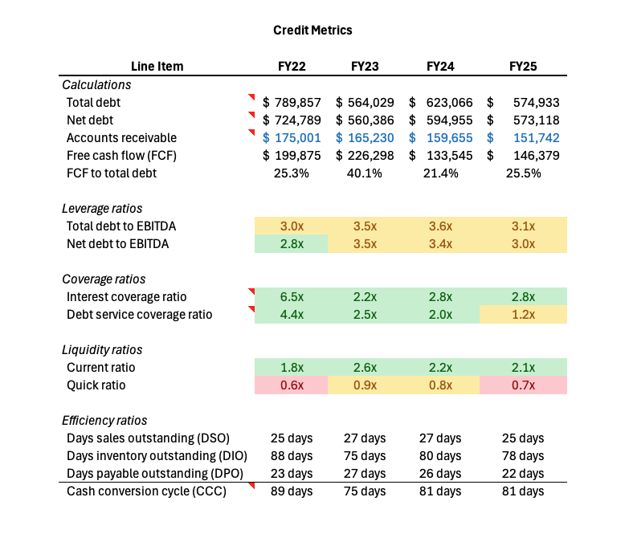

# ADENTRA Inc. — Commercial Credit Analysis

Commercial credit analysis of ADENTRA Inc. (TSX: ADEN), one of North America's 
largest distributors of specialty architectural building products, operating 81 
facilities across the US and Canada with FY2025 revenue of $2.25 billion.

This project replicates the workflow a junior analyst would follow in a commercial 
banking credit team: spread the financials, calculate the credit metrics, assess 
the risks, and write a memo that gives a credit committee everything it needs to 
make a lending decision.

---

## Project Structure

| File | Description |
|------|-------------|
| `AdentraCreditAnalysis.xlsx` | Four-year financial spread with credit metrics |
| `ADENTRA_Credit_Memo.docx` | Two-page credit memo structured to Big Six bank standards |

---

## The Financial Model

The Excel workbook contains four sheets built from ADENTRA's publicly available 
annual reports sourced from SEDAR+.

**Income Statement** — Revenue, gross profit, EBITDA, EBIT, and net income across 
FY2022 to FY2025, with year over year growth rates and margin percentages calculated 
for each line item.

**Balance Sheet** — Full asset and liability spread including current assets, PP&E, 
goodwill, total debt (bank indebtedness and lease obligations under IFRS 16), and 
shareholders equity. Balance sheet verified to balance across all four years.

**Cash Flow Statement** — Operating, investing and financing activities with free 
cash flow calculated as operating cash flow minus capital expenditures.

**Credit Metrics** — Ten ratios calculated across all four fiscal years with 
traffic light conditional formatting indicating healthy, watch, and concern thresholds.

---

## Credit Metrics Summary

| Metric | FY2022 | FY2023 | FY2024 | FY2025 |
|--------|--------|--------|--------|--------|
| Total Debt to EBITDA | 3.0x | 3.5x | 3.6x | 3.1x |
| Net Debt to EBITDA | 2.8x | 3.5x | 3.4x | 3.0x |
| Interest Coverage | 6.5x | 2.2x | 2.8x | 2.8x |
| DSCR | 4.4x | 2.5x | 2.0x | 1.2x |
| Current Ratio | 1.8x | 2.6x | 2.2x | 2.1x |
| Quick Ratio | 0.6x | 0.9x | 0.8x | 0.7x |
| DSO | 25 days | 27 days | 27 days | 25 days |
| DIO | 88 days | 75 days | 80 days | 78 days |
| DPO | 23 days | 27 days | 26 days | 22 days |
| FCF to Total Debt | 25.3% | 40.1% | 21.4% | 25.5% |

---

## Key Findings

- **Leverage is manageable and improving.** Total Debt to EBITDA declined from 3.6x 
in FY2024 to 3.1x in FY2025, supported by EBITDA growth of 8.7% and a $102.5M term 
loan repayment. Net debt to capitalization improved from 52% in FY2022 to 32% in 
FY2025.

- **DSCR is the primary credit concern.** Debt Service Coverage deteriorated from 
4.4x in FY2022 to 1.20x in FY2025, sitting below the 1.25x commercial lending 
threshold. The FY2025 decline is attributable to a one-time term loan repayment 
rather than earnings weakness, but the four-year trend warrants a binding covenant 
regardless of the one-year explanation.

- **Gross margin stability is the strongest indicator of credit quality.** ADENTRA 
held gross margin above 20% in every quarter from FY2022 through FY2025, including 
through a 15% cumulative revenue decline driven by post-COVID price deflation and 
housing market softness. That stability is inconsistent with commodity distribution 
and reflects a specialty product mix with lower price elasticity.

- **Free cash flow is consistently strong.** Operating cash flow averaged $188M 
annually across the four-year cycle. Capital expenditures are structurally modest at 
$10 to $14M given the leased facility model, converting the majority of operating 
cash flow into free cash flow available for debt service.

---

## The Credit Memo

The two-page credit memo follows the structure a commercial banking analyst at a 
Big Six Canadian bank would use when presenting to a credit committee. Sections 
include:

1. Executive Summary
2. Business Overview
3. Industry and Competitive Position
4. Financial Analysis
5. Credit Metrics Summary
6. Key Risks
7. Lending Recommendation

**Recommendation:** Conditional approval, subject to a minimum DSCR of 1.15x, 
maximum Total Debt to EBITDA of 3.75x, minimum Interest Coverage of 2.5x, and 
semi-annual covenant testing.

---

## Data Sources

- ADENTRA Inc. Annual Reports (FY2022 to FY2025)
- SEDAR+ (sedarplus.ca)
- ADENTRA Investor Relations

---

## Tools Used

`Microsoft Excel` · `Financial Spreading` · `Credit Analysis` · `Ratio Analysis` · 
`Credit Memo Writing`
